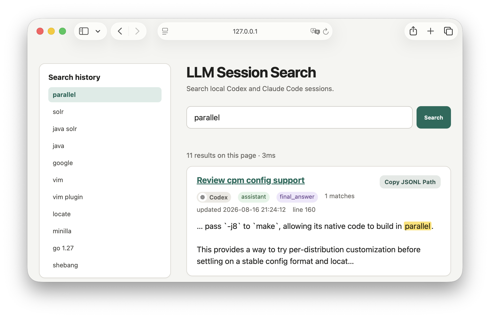

# llm-session-search



`llm-session-search` indexes user and assistant messages from local Codex and
Claude Code JSONL sessions and provides a web interface for finding previous
conversations. Its best-effort parsers support multiple session schema
generations.

## Build and run

```console
go build
./llm-session-search
```

Open <http://127.0.0.1:8787/>. Before listening, the application creates or
updates `~/.llm-session-search/index.db` from:

- `~/.codex/sessions/**/*.jsonl`
- `~/.codex/archived_sessions/**/*.jsonl`

and from main Claude Code transcripts under:

- `${CLAUDE_CONFIG_DIR:-~/.claude}/projects/*/*.jsonl`

It then updates the index every minute. Unchanged files are skipped, append-only
updates resume from the previous offset, and source files are never modified.
Claude Code subagent transcripts are not indexed.

The index database has no schema migration support. After an update that changes
the schema or indexed content, stop the process, delete `index.db`, and restart
the application to rebuild it from the session files.

Available options:

```console
./llm-session-search \
  --codex-home /path/to/.codex \
  --claude-home /path/to/.claude \
  --data-dir /path/to/data \
  --listen 127.0.0.1:9000 \
  --index-interval 1m
```

Set `--index-interval 0` to disable background updates. The startup update
always runs. The data directory stores the database as `index.db`; daemon mode
also uses it for `app.pid` and `app.log`.

To run the server in the background:

```console
./llm-session-search --daemon
```

`--daemon` waits until the server is listening. If the daemon is already
running, it reports the existing PID and exits successfully. Use the following
options to inspect or control it:

```console
./llm-session-search --daemon-status
./llm-session-search --daemon-stop
./llm-session-search --daemon-restart
```

Stopping an already stopped daemon also succeeds. Status exits with a non-zero
status when the daemon is not running. Restart starts a new daemon when none is
running. The four daemon options are mutually exclusive. Other options can be
combined with `--daemon` and `--daemon-restart`; use the same `--data-dir` for
all later status and control operations.

## Search behavior

Space-separated terms use session-level AND semantics, so terms may occur in
different messages. Double quotes match a phrase, for example
`tinyenv "github actions"`. Terms of at least three Unicode characters use
SQLite FTS5 trigram search; shorter terms use a substring scan.

Typing triggers a search after 500 milliseconds when all terms are at least
three characters. Whitespace, a closing quote, Enter, or the Search button runs
it immediately. Search terms are highlighted in result and session pages.

## Search API

The local HTTP server provides a JSON search API for scripts and agents:

```console
curl --get \
  --data-urlencode 'q=tinyenv "github actions"' \
  --data-urlencode 'cwd=/path/to/project' \
  --data-urlencode 'limit=10' \
  http://127.0.0.1:8787/api/v1/search
```

Results are grouped by session and include the source JSONL path, session ID,
title, working directory, timestamps, and up to three matching records. The
optional `cwd` parameter limits results to that working directory and its
descendants. Each matching record identifies its `matched_terms`; records that
match more terms are returned first, followed by user messages and newer
records.
Codex results also include their `codex://threads/<session-id>` URL. Use
`offset` with the returned `next_offset` to fetch another page. API searches do
not update the web interface's search history.

The left pane stores the 50 most recent distinct global queries. Session pages
show their Codex or Claude Code source alongside role and phase badges and can
copy the current JSONL path. Codex sessions also provide a
`codex://threads/<session-id>` link. System, developer, tool, thinking, and
other internal records are neither indexed nor displayed. Encrypted content,
base64 data URLs, automatically injected AGENTS.md, plugin, environment context,
Claude Code system reminders, and local commands are also excluded.

## Privacy

The web server listens on `127.0.0.1` by default and uses no external assets.
The data directory is created with mode `0700`, and the SQLite database uses
mode `0600`. The database still contains extracted text from local Codex and
Claude Code sessions and should be treated as sensitive.
